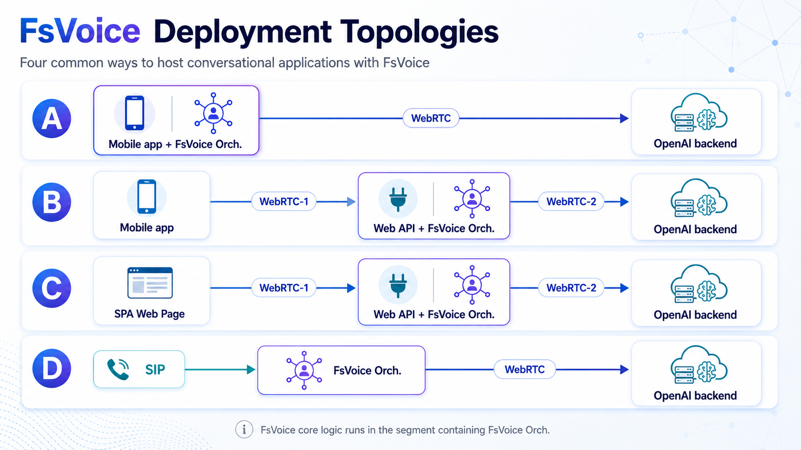

# FsVoice - A Platform for Building Conversational Applications

In a highly contested AI marketplace, OpenAI currently has a true strategic moat with its `gpt-realtime` voice API. Its core advantage is the multitude of available voices that exhibit natural tone, intonation, and pacing. OpenAI has truly crossed the [uncanny valley](https://spectrum.ieee.org/the-uncanny-valley?utm_source=chatgpt.com) here.

Despite these capabilities, most voice applications still feel like chat applications with a microphone attached. FsVoice is designed to take full advantage of the gpt-realtime API’s native capabilities while compensating for its current limitations. Additionally, FsVoice is architected as a set of interfaces and components that can be implemented and assembled à la carte to build highly customized applications.

The following sections describe the various aspects of the FsVoice platform, culminating with a high-level description of the FsVoice-based [Speak2Docs](https://apps.apple.com/app/6771490875) mobile application that puts it all together.

## Open-source FsVoice voice server

FsVoice also includes a self-hosted voice server that runs the complete voice
turn locally: Parakeet ONNX transcription, Silero VAD endpointing, Gemma GGUF
through bundled llama.cpp, Pocket TTS synthesis, and FsColbert retrieval. It
serves the browser test page and WebSocket/WebRTC clients on port `5067`.

The server uses natural, server-side VAD rather than Start/End-turn controls.
With barge-in enabled (the default), a confirmed new utterance stops current
generation and playback before the next answer begins. Conversation history is
kept as a rolling ten-turn window.

Model weights, voice samples, and indexes are deliberately external to the
image. For a workstation or A100 deployment, mount or point directly at the
shared asset directories. In Kubernetes or automated deployments, the same
image can bootstrap a pinned immutable asset release from Azure Blob Storage or
Amazon S3 into a verified node-local cache before llama.cpp starts.

Quick links:

- [Docker and local deployment](docs/open-source-docker.md)
- [Cloud asset manifests, publishing, cache bootstrap, and Helm](docs/open-source-assets.md)
- [Docker Compose environment example](deploy/open-source/.env.example)
- [Remote Azure Blob/S3 Compose example](deploy/open-source/.env.remote.example)
- [Helm chart](deploy/open-source/helm/fsvoice)

Gemma answer limits are configurable because the generation budget includes
both private thinking and the public answer. The supplied defaults are 1,024
tokens for deep requests, 768 for balanced requests, and 192 for direct fast
requests; see the Docker guide for the corresponding environment overrides.

## 1. Exploiting the Realtime API
The following sections describe what gpt-realtime provides, how FsVoice exploits those capabilities, and where FsVoice adds architectural support to fill the gaps.

### 1.1 Realtime Two-way Message Streams
The Realtime API connection is established over either *WebRTC* or *WebSockets*. Once connected, the API continuously streams events to the application. The application receives these events in real time and can respond immediately: either by adjusting its own behavior or by sending messages back to the API to influence the conversation state, behavior, or flow on the API side.

FsVoice preserves 'mechanical sympathy' by authentically treating the API as a two-way message channel rather than trying to morph it into a chat-style interface. For this, it builds upon three prior-developed frameworks:

- [*RTOpenAI.Events*](https://github.com/fwaris/RTOpenAI/tree/master/src/RTOpenAI.Events) which provides strongly-typed wrappers over realtime events for easier API discoverability and use. These are usable with both *WebRTC* and *WebSockets* connections.
- [*RTOpenAI.Api*](https://github.com/fwaris/RTOpenAI/tree/master/src/RTOpenAI.Api) provides *WebRTC* connectivity for mobile apps (iOS and Android). Other *WebRTC* libraries exist for non-mobile use.
- [*RTFlow*](https://github.com/fwaris/RTOpenAI/tree/master/src/RTFlow) is a framework for constructing realtime, multi-agent orchestrations. As we will see later, this capability will prove quite useful for addressing some of the Realtime API's shortcomings.

### 1.2 Managing the *Realtime* vs. *Instruction Following* Tradeoff

By necessity, gpt-realtime is optimized for low-latency response so that spoken conversations remain fluid and natural. The tradeoff is that it has more limited instruction-following and reasoning capabilities than slower, text-oriented models. Realtime may lose context in long, drawn-out conversations. It is certainly not as strong a reasoner as the gpt-5.x family. FsVoice manages this tradeoff in two distinct ways, discussed next.

#### 1.2.1 Multi-Agent: Voice + Oracle
FsVoice pairs the real-time voice model with a gpt-5.x model in a multi-agent setup implemented using RTFlow. The Voice agent owns the real-time connection and handles the live conversational flow, while collaborating with an Oracle agent for complex queries through real-time messages sent over the Agent Bus. This does introduce additional latency, but the overall experience remains acceptable because the real-time model can bridge the delay with natural conversational fillers such as “Let me check...” or “Give me a moment...”. This idea is inspired by [Kame](https://pub.sakana.ai/kame/) from *sakana.ai*. In my experiments, I found that gpt-realtime does not respond as well to injected suggestions from the *Oracle*. Instead, what works well is gpt-realtime using the *Oracle* as a *tool provider*. It then honors the responses much more.

#### 1.2.2 OpenAI *Responses* API over *WebSockets*
To further reduce *Oracle* latency, I moved FsVoice to the new *WebSockets*-based version of the OpenAI *Responses* API. This gives FsVoice a persistent, low-overhead communication channel between the *Oracle* agent and the serving LLM.

Key benefits include:

- **Lower per-call latency**: With traditional HTTP requests, each model call incurs request setup overhead. With *WebSockets*, the connection remains open, allowing FsVoice to send Oracle requests immediately over an already-established channel.

- **Server-side conversation state**: The *Responses* API allows FsVoice to send only the latest message while the prior conversation context is retained server-side. This reduces latency when compared to the common pattern in traditional chat APIs, where the full message history must be resent on every call.

- **High cache hit rate**: Since *Responses* encourages append-only context, the chance of using cached tokens becomes much higher. The use of cached tokens significantly reduces not only latency but also cost. Cached tokens are about 1/10th the cost of regular tokens. A cache strategy should be a significant component of contemporary AI systems.

To reduce context bloat and the potential dilution of recent information in long-running conversations, FsVoice periodically compacts the *Oracle* context. This is done offline so as not to impact the conversational flow. If the model needs more detail after compaction, it calls the available retrieval or memory tools again for the latest turn.

## 2. FsVoice Deployment Topologies
The FsVoice platform affords several types of deployment topologies, from mobile and desktop to web. While a wide variety of configurations are possible, the salient ones are highlighted below:

For enterprises, the interesting topologies are B and D.

In topology B, the mobile app establishes a first WebRTC connection (*WebRTC-1*) to the Web API. The Web API then acts as the bridge, forwarding the app’s audio stream to OpenAI over a second WebRTC connection (*WebRTC-2*). The FsVoice orchestration runs inside the Web API and coordinates both sides of the interaction: it manages the OpenAI realtime message stream over *WebRTC-2* while also maintaining a separate application-level message stream with the mobile app over *WebRTC-1*. The main benefit here is that the audio conversation can be synced with on-screen updates in the app UI. For example, if the user says "show me product X," that will result in the UI getting updated accordingly.

In topology D, FsVoice sits directly on the [SIP](https://www.rfc-editor.org/rfc/rfc5411.html) side of a telephony flow. It receives audio from the phone network over SIP, runs the FsVoice orchestration server-side, and connects to the OpenAI backend over *WebRTC* (or optionally *WebSockets*). This topology is especially relevant for enterprise telephony, contact-center, and SIP trunk integration scenarios.

## 3. FsVoice Architecture
As a platform, FsVoice has an open, pluggable architecture. Applications can be constructed by implementing well-defined interfaces and assembling pre-built components à la carte. The top infographic depicts the platform artifacts and how they are used to construct the Speak2Docs sample application. The main interfaces and components are described in more detail next.

- **Platform Components**: The core collection of components and interfaces to build FsVoice-based applications:
    - Interfaces that abstract the orchestration functionality from the hosting environment so that multi-agent orchestrations are pluggable into mobile, web, or SIP-enabled hosts.
    - *Oracle*-style question-answering enablers.
    - Other supporting interfaces and components, e.g., for loading custom tools and plug-ins, which enable quick customization.

- **Memory, Indexed Content, Search & Retrieval**: FsVoice applications can include pre-packaged, chunked indexed content. This content can be searched and retrieved from an orchestration using built-in tools. A hybrid *keyword plus semantic* search strategy is used. The semantic part is based on the *late interaction* approach described in [ColBERT: Efficient and Effective Passage Search via Contextualized Late Interaction over BERT](https://arxiv.org/abs/2004.12832) (Khattab and Zaharia, SIGIR 2020). Note that late interaction requires a multi-vector embedding model. For FsVoice, a small [ONNX](https://onnx.ai/) model, running locally, generates embedding vectors for user queries. It is fast enough for use on contemporary, higher-end smartphones. Search and indexing uses the externally referenced [FsColbert](https://github.com/fwaris/fscolbert) project/package.

- **FsResponses**: Supports the OpenAI *Responses* API over *WebSockets* with strongly-typed message wrappers for easier discoverability and use.

## 4. Speak2Docs - FsVoice-based Sample Application
*Speak2Docs* is a FsVoice-based mobile application for 'conversing with your documents'. It serves as a demo for FsVoice but should also be useful for people on the move who want to query content in a hands-free way. For example, mobile technicians, first responders, nurses, etc. Topologically, it conforms to pattern A above.

*Speak2Docs* is currently available for iOS in the US and Canada:

-  

- Or use the QR code at the end of this post.

> Note: *Speak2Docs* uses the cross-platform framework [*.NET MAUI*](https://dotnet.microsoft.com/en-us/apps/maui) so it's also an Android app. It's not in the store yet but can be built from source to test. See *References* for links.

### 4.1 Operation and Use
The app can be used to query indexed document content by voice in a natural, conversational way.

> The app needs an OpenAI key to work. Users can generate a key at https://platform.openai.com. The key has to be funded for the app to work.

The connection is established when the microphone icon is tapped (see screenshot below). ***A noise-cancelling headset works best; otherwise the voice model can pick up ambient noise (or its own audio from the speaker) and get interrupted***.

#### Screenshot:

A pre-built document index is included for quick start. Users can index additional PDF and Markdown content using the '+' button. One or more available sources can be selected for a single question-answer session.

### 4.2 Question-Answering
*Speak2Docs*'s orchestration is multi-agent. The agents collaborate via messages broadcast over the agent bus. The three agents used are:

- **Voice**: Manages the gpt-realtime API communication. Note that the user's audio conversation happens concurrently with the messaging between gpt-realtime and the app. The Realtime API sends a steady stream of messages informing the app of every detail. However, the app only needs to handle the messages it cares about. Tool calls still have to be handled. The voice model is configured to use the *Oracle* agent via a tool call if the voice model cannot easily answer the user query by itself. The voice model speaks fillers like "Let me check ..." when it makes a tool call due to the expected latency of the response. It then speaks the final answer when the results of the tool call become available.

- **Oracle**: Maintains a *WebSocket*-based *Responses* API connection to the reasoning model (default `gpt-5.5`). Primarily, the *Oracle* listens for query requests from the *Voice* agent. It relays the query to the reasoning model, which then formulates the response. The reasoning model may invoke one or more of the available tools before the final response. Indexed content search is one of the available tools.

- **Host**: The *Host* agent is a bridge between the agent orchestration and the app. It listens to messages of interest and relays them to the app for UI updates, etc. It can also work the other way, where the app can control the orchestration by injecting messages into the bus via the *Host* agent.

#### Agent Setup:
.png)

The multi-agent setup enables the app to answer complex queries that would be beyond the capabilities of the voice model alone. There is increased latency, but it's still acceptable because the reasoning model is accessed via the low-latency *WebSockets* connection and the voice model tries to maintain a natural conversational flow.

### 4.3 Content Indexing and Search
Additional Markdown and PDF content can be ingested and indexed locally in the app. For Markdown, the parsing and chunking process takes advantage of the Markdown structure - headings, subheadings, etc. - so that indexed chunks retain semantic context. For PDFs, something similar is done but with the help of a small ONNX model to 'understand' page layout from rendered page images.

Additionally, the keywords extracted from the text chunks can be optionally expanded via gpt-nano calls before building the final index.

At query time, gpt-nano is also used to extract keywords from the user query and optionally expand them with synonyms before performing keyword and semantic searches on the selected content. The search results are combined with RRF ([Reciprocal Rank Fusion](https://dl.acm.org/doi/10.1145/1571941.1572114?)) with adjustable weights.

## 5. Conclusion

FsVoice is a platform for treating voice applications as real-time, event-driven systems rather than chat applications with audio input bolted on. The main architectural move is to let the low-latency voice model do what it does best, which is to carry the conversation, while delegating source-grounded reasoning, tool use, and document retrieval to an Oracle agent backed by stronger reasoning models.

*Speak2Docs* is a sample application of that pattern. It combines real-time speech, local indexing, retrieval, and model tool-calling into a mobile document assistant that can run on selected user content. The same platform pieces can also be reused for web, enterprise, and telephony scenarios where conversational AI needs to be coordinated with application state, domain tools, and private knowledge sources.

## References

- Speak2Docs on the App Store: <https://apps.apple.com/app/6771490875>
- FsVoice / Speak2Docs project details: [projects.md](projects.md)
- OpenAI Realtime API guide: <https://platform.openai.com/docs/guides/realtime/>
- OpenAI Realtime API with WebRTC: <https://platform.openai.com/docs/guides/realtime-webrtc>
- OpenAI Responses API reference: <https://platform.openai.com/docs/api-reference/responses>
- RTOpenAI and RTFlow: <https://github.com/fwaris/RTOpenAI>
- FsColbert: <https://github.com/fwaris/fscolbert>
- ColBERT paper: <https://arxiv.org/abs/2004.12832>
- Reciprocal Rank Fusion paper: <https://dl.acm.org/doi/10.1145/1571941.1572114>
- Kame by Sakana AI: <https://pub.sakana.ai/kame/>
- .NET MAUI documentation: <https://learn.microsoft.com/en-us/dotnet/maui/>
- ONNX: <https://onnx.ai/>
- SIP overview, RFC 5411: <https://www.rfc-editor.org/rfc/rfc5411.html>

#### Speak2Docs QR Code

