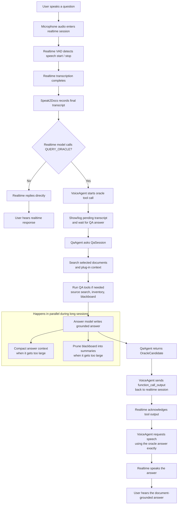

# FsVoice and Speak2Docs: Building Voice-First Document QA in F#

Most voice apps still feel like chat apps with a microphone attached.

That is useful, but it is not the same thing as a voice-first system. A voice-first app has to listen continuously, decide when speech is casual and when it needs a grounded answer, coordinate realtime audio with slower backend reasoning, search local context, call tools, and return something short enough to speak without losing the evidence behind it.

That is the design problem behind FsVoice and Speak2Docs.

FsVoice is the reusable platform layer. Speak2Docs is the app built on top of it: a .NET MAUI application that lets someone add documents, build or import local retrieval indexes, connect to OpenAI realtime voice, and ask questions about selected sources out loud.

## The Product: Speak2Docs

Speak2Docs is a document question-answering app designed around spoken interaction.

A user can add PDF or Markdown sources, import zipped FsColbert index bundles, select ready documents, connect a realtime voice session, and ask questions naturally:

- "What is this paper about?"
- "Summarize the abstract."
- "Compare the selected documents."
- "What did it say about anomaly detection?"
- "Which sources are currently loaded?"

The important part is that the realtime voice model is not expected to invent the answer from the conversation alone. For substantive questions, it calls a backend oracle tool. That backend searches selected sources, applies retrieval policy, gathers tool observations, builds an answer prompt, and returns a grounded response for the realtime layer to speak.

This separation matters. Realtime voice is excellent at turn-taking, interruption, transcription, and speech output. Document QA needs a different shape: source retrieval, chunk ranking, tool orchestration, context budgeting, and answer grounding. FsVoice keeps those responsibilities separate but connected.

## The Platform: FsVoice

FsVoice is the reusable architecture underneath Speak2Docs.

At the center are typed contracts and runtime packages:

- `FsVoice.Platform` defines typed voice sessions, voice connections, orchestration contexts, and host message codecs.
- `FsVoice.QA.Abstractions` defines QA sources, chunks, retrieval modes, sessions, tools, plugins, context providers, and model roles.
- `FsVoice.QA` implements retrieval, keyword enrichment, tool orchestration, blackboard context, durable memory support, FsColbert indexing, and hybrid PDF processing.
- `FsVoice.PdfRasterization` supplies platform-specific PDF rasterizers for hybrid parsing.
- `FsVoice.Hosting.AspNetCore` provides a bridge for browser/WebRTC-style hosts.
- `FsVoice.RTFlow` adapts RTFlow workflows to the public voice session contract.
- `FsResponses` provides typed OpenAI Responses and Responses WebSocket helpers used by the QA backend.

The app supplies the host shell, settings, sources, plugins, and user experience. The platform supplies the contracts and reusable machinery.

That split is the main architectural bet: voice workflows should be composable, not trapped inside a single app.

## The Speak2Docs Assembly

Speak2Docs composes the platform into a concrete app:

1. The MAUI host owns settings, source picking, app storage, microphone permission, and connection lifetime.
2. The orchestration layer starts a workflow with a voice agent, QA agent, and host agent.
3. The voice agent configures the realtime session and exposes a `QUERY_ORACLE` tool.
4. The QA agent creates a `QaSession`, loads selected source context, attaches plugin context providers, and passes tool providers into the QA runtime.
5. The QA session retrieves source chunks, invokes tools when needed, builds the answer prompt, manages blackboard context, and returns an answer candidate.
6. The voice agent sends that answer back to the realtime session as tool output and requests speech using the oracle answer exactly.

The result is a voice loop where the fast audio layer and the slower evidence layer each do the work they are good at.

## User-Level Flow

The user-level flow is intentionally simple:

Diagram source: [`diagrams/user_flow.mmd`](../diagrams/user_flow.mmd)

What I like about this flow is that it allows both low-latency conversation and deliberate retrieval. The realtime model can still greet, clarify, or handle simple interaction directly. But when the user asks a real question about selected material, the app moves into a grounded answer path.

## Under The Hood

The deeper flow has more moving parts.

Diagram source: [`diagrams/global_flow.mmd`](../diagrams/global_flow.mmd)

The diagram is dense because the hard part is not a single model call. The hard part is coordination:

- WebRTC and realtime events have to be pumped through local channels.
- The host needs typed messages rather than provider-specific JSON everywhere.
- Transcripts need stable turn ids.
- Tool calls need to survive asynchronous backend work.
- Source retrieval needs to be reconfigurable when the selected documents change.
- Long sessions need compaction and blackboard pruning.
- The spoken answer needs to preserve the backend answer instead of improvising over it.

That is why FsVoice is platform-shaped instead of app-shaped.

## Why Plugins Matter

Document QA is rarely generic for long.

An insurance benchmark, a legal review app, a research assistant, and an internal support tool may all need voice QA, but they do not share the same prompts, vocabulary, tools, model roles, or retrieval defaults.

FsVoice QA plugins let each domain define:

- prompt templates;
- model role defaults;
- voice replacements;
- query expansion rules;
- keyword hints;
- runtime options;
- settings fields;
- tool providers;
- context providers.

Speak2Docs loads bundled plugins and supported folder plugins, then composes plugin defaults with host settings. The Generic QA plugin is the fallback, but the architecture expects specialized behavior.

## Why Local Indexes Matter

Speak2Docs treats sources as app-owned local knowledge.

When a document is processed, its passages and FsColbert index can be persisted. When a bundle is imported, the app installs the source and its `.fsci` index together. A source can then be selected, searched, previewed, retried, deleted, or restored without turning the whole app into a remote document store.

This is useful for mobile and desktop workflows where the user wants document control, repeatable retrieval, and a clear boundary between local files and model calls.

## The Design Lesson

The biggest lesson from FsVoice is that voice UX is a systems problem.

A good spoken document assistant is not just:

> audio in, answer out

It is:

> audio in, transcript, turn state, tool decision, retrieval, prompt construction, answer generation, context maintenance, tool output, speech synthesis, and cleanup

FsVoice makes that pipeline explicit. Speak2Docs proves the pipeline in a real app.

That is the part I find most interesting: the platform is not trying to hide the complexity. It gives the complexity names, contracts, and boundaries so that an app can choose what to replace.

Host shell. Plugin. Tools. Context providers. Retrieval policy. Runtime settings. Model roles. Transport.

Those are the pieces you need when voice becomes an application surface instead of a novelty input method.

## Links For The Repo

- Platform image: [`imgs/platform.png`](../imgs/platform.png)
- User flow Mermaid source: [`diagrams/user_flow.mmd`](../diagrams/user_flow.mmd)
- Runtime flow Mermaid source: [`diagrams/global_flow.mmd`](../diagrams/global_flow.mmd)
- Main README: [`README.md`](../README.md)

