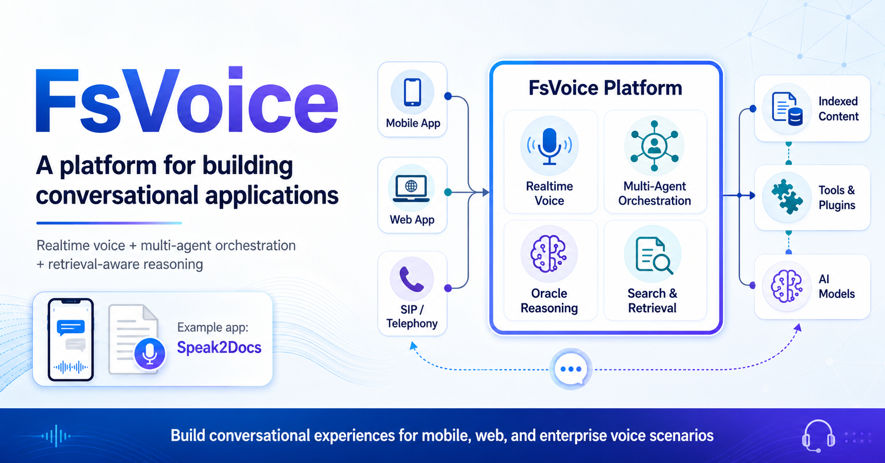
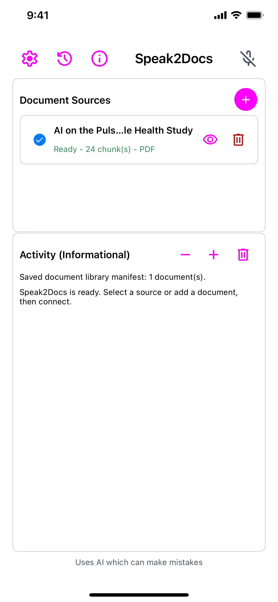
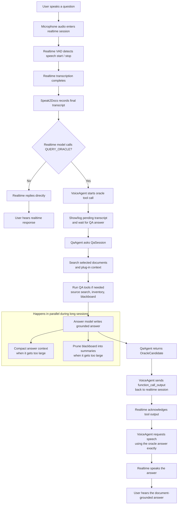

# FsVoice - A Platform for Building Conversational Applications

In an highly contested AI marketplace, OpenAI currently has a true strategic moat with its `gpt-realtime` voice API. Their core advantage is the multitude of available voices that exhibit natural tone, intonation and pacing. OpenAI has truly crossed the [uncanny valley](https://spectrum.ieee.org/the-uncanny-valley?utm_source=chatgpt.com) here.

Despite these capabilities, most voice applications still feel like chat applications with a microphone attached. FsVoice is designed to take full advantage of the gpt-realtime API’s native capabilities while compensating for its current limitations. Additionally, FsVoice is architected as a set of interfaces and components that can be implemented/assembled a la carte to build highly customized applications.

The following sections describe the various aspects of the FsVoice platform, culminating with a high level descriptions of the FsVoice-based [Speak2Docs](https://apps.apple.com/app/6771490875) mobile application that puts it all together.

## 1. Exploiting the Realtime API
The following sections describe what gpt-realtime provides, how FsVoice exploits those capabilities, and where FsVoice adds architectural support to fill the gaps.

### 1.1 Realtime Two-way Message Streams
The Realtime API connection is established over either *WebRTC* or *Web Sockets*. Once connected, the API continuously streams events to the application. The application receives these events in real time and can respond immediately: either by adjusting its own behavior or by sending messages back to the API to influence the conversation state, behavior, or flow on the API side.

FsVoice preserves 'mechanical sympathy' by authentically treating the API as two-way message channel rather trying to morph it into a chat-style interface. For this, it builds upon three prior-developed frameworks:

- [*RTOpenAI.Events*](https://github.com/fwaris/RTOpenAI/tree/master/src/RTOpenAI.Events) which provides strongly-typed wrappers over realtime events for easier API discoverability and use. These are usable with both *WebRTC* and *Web Sockets* connections.
- [*RTOpenAI.Api*](https://github.com/fwaris/RTOpenAI/tree/master/src/RTOpenAI.Api) provides *WebRTC* connectivity for mobile apps (IOS and Android). Other *WebRTC* libraries exist for non-mobile use.
- [*RTFlow*](https://github.com/fwaris/RTOpenAI/tree/master/src/RTFlow) is framework for constructing realtime, multi-agent orchestrations. As we will see later this capability will prove quite useful for addressing some of the realtime APIs shortcomings.

### 1.2 Managing the *Realtime* vs. *Instruction Following* Tradeoff

By necessity, gpt-realtime is optimized for low-latency response so that spoken conversations remain fluid and natural. The tradeoff is that it has more limited instruction-following and reasoning capabilities than slower, text-oriented models. Realtime may lose context in long, drawn out conversations. And its certainly not as strong a reasoner as the gpt-5.X family. FsVoice manages this tradeoff in a two distinct ways, discussed next.

#### 1.2.1 Multi-Agent: Voice + Oracle
FsVoice pairs the real-time voice model with a gpt-5.x model in a multi-agent setup implemented using RTFlow. The Voice agent owns the real-time connection and handles the live conversational flow, while collaborating with an Oracle agent for complex queries through real-time messages sent over the Agent Bus. This does introduce additional latency, but the overall experience remains acceptable because the real-time model can bridge the delay with natural conversational fillers such as “Let me check...” or “Give me a moment...”. This idea is inspired by [Kame](https://pub.sakana.ai/kame/) from *sakana.ai*. In my experiments I found that gpt-realtime does not respond so well to injected suggestions from the *Oracle* but rather what works well is gpt-realtime using the *Oracle* as a *tool provider*. It then honors the responses much more.

#### 1.2.2 OpenAI *Responses* API over *Web Sockets*
To further reduce *Oracle* latency, I moved FsVoice to the new *Web Sockets*-based version of the OpenAI *Responses* API. This gives FsVoice a persistent, low-overhead communication channel between the *Oracle* agent and the serving LLM.

Key benefits include:

- **Lower per-call latency**: With traditional HTTP requests, each model call incurs request setup overhead. With *Web Sockets*, the connection remains open, allowing FsVoice to send Oracle requests immediately over an already-established channel.

- **Server-side conversation state**: The *Responses* API allows FsVoice to send only the latest message while the prior conversation context is retained server-side. This reduces latency when compared to the common pattern in traditional chat APIs, where the full message history must be resent on every call.

- **High cache hit rate**: Since *Responses* encourages append-only context, the chances of using cached tokens becomes much higher. The use of cached tokens significantly reduces not only latency but also cost. Cached tokens are about 1/10th the cost of regular tokens. Cache strategy should be a significant component of contemporary AI systems. 

To reduce context bloat and the potential dilution of recent information, in the case of long-running conversations, FsVoice periodically compacts the *Oracle* context. This is done offline so as not to impact the conversational flow. The raw context is still maintained for a while longer in a 'Blackboard' agentic memory system that the *Oracle* can consult via tool calls if required.

## 2. FsVoice Deployment Topologies
The FsVoice platform affords several types of deployment topologies from mobile, desktop to web. While a wide variety of configurations are possible, the salient ones are highlighted below:

<ol type = "A">
<li style="margin-bottom: 0.75rem;">{▣ Mobile app + <strong><code>[FsVoice Orch.]</code></strong>}   &rarr;[WebRTC] {⌬ OpenAI backend}
</li>

<li style="margin-bottom: 0.75rem;">▣ Mobile app   &rarr; [WebRTC-1] {🔌 Web API + <strong><code>[FsVoice Orch.]</code></strong>}   &rarr; [WebRTC-2] {⌬ OpenAI backend}
</li>

<li style="margin-bottom: 0.75rem;">▣ SPA Web Page   &rarr; [WebRTC-1] {🔌 Web API + <strong><code>[FsVoice Orch.]</code></strong>}   &rarr; [WebRTC-2] {⌬ OpenAI backend}
</li>

<li style="margin-bottom: 0.75rem;">[SIP] <strong><code>[FsVoice Orch.]</code></strong>}   &rarr; [WebRTC] ⌬ OpenAI backend
</li>

</ol>

The leg containing <strong><code>[FsVoice Orch.]</code></strong> is where the FsVoice core logic runs. For enterprises, the interesting topologies are B. and D. 

In topology B, the mobile app establishes a first WebRTC connection (*WebRTC-1*) to the Web API. The Web API then acts as the bridge, forwarding the app’s audio stream to OpenAI over a second WebRTC connection (*WebRTC-2*). The FsVoice orchestration runs inside the Web API and coordinates both sides of the interaction: it manages the OpenAI realtime message stream over *WebRTC-2* while also maintaining a separate application-level message stream with the mobile app over *WebRTC-1*. The main benefit here is that the audio conversation can be synced with on-screen updates in the app UI. For example, if the user says show me product X then that will result in the UI getting updated accordingly.

In topology D, FsVoice sits directly on the SIP side of a telephony flow. It receives audio from the phone network over SIP, runs the FsVoice orchestration server-side, and connects to the OpenAI backend over *WebRTC* (or optionally *Web Sockets*). This topology is especially relevant for enterprise telephony, contact-center, and SIP trunk integration scenarios.

## 3. FsVoice Architecture
As a platform, FsVoice has an open, pluggable architecture. Applications can be constructed by implementing well defined interfaces and assembling pre-built components a-la-carte. The top infographic depicts the platform artifacts and how they are used to construct the Speak2Docs sample application. The main interfaces and components are described in more detail next.

- **Platform Components**: The core collection of components and interfaces to build FsVoice-based applications:
    - Interfaces that abstract the orchestration functionality from the hosting environment so that multi-agent orchestrations are pluggable into mobile, Web or SIP-enabled hosts.
    - *Oracle*-style question-answering enablers
    - Other supporting interfaces and components, e.g., for loading custom tools and plug-ins which enable quick customization. 

- **Memory, Indexed Content, Search & Retrieval**: FsVoice applications can include pre-packaged, chunked indexed content. This content can be searched and retrieved from an orchestration using built-in tools. A hybrid - *keyword plus semantic* - search strategy is used. The semantic part is based on the *late interaction* approach described in [ColBERT: Efficient and Effective Passage Search via Contextualized Late Interaction over BERT](https://arxiv.org/abs/2004.12832) (Khattab and Zaharia, SIGIR 2020). Note that late interaction requires a multi-vector embedding model. For FsVoice, a small ONNX model, running locally, generates embedding vectors for user queries. It is fast enough for use on contemporary, higher-end, smart phones. Search and indexing uses the externally referenced [FsColbert](https://github.com/fwaris/fscolbert) project/package.

- **FsResponses**: Supports the OpenAI *Responses* API over *Web Sockets* with strongly-typed message wrappers for easier discoverability and use.

## 4. Speak2Docs - FsVoice-based Sample Application
*Speak2Docs* is a FsVoice-based mobile application for 'conversing with your documents'. It serves as a demo for FsVoice but should be useful also for people on the move who want to query content in a hands-free way. For example, mobile technicians, first responders, nurses, etc. Topologically, it conforms to pattern A above.

 *Speak2Docs* is currently available for IOS in US and Canada:

-  

- Or use the QR-code at the end of this post.

> Note: *Speak2Docs* uses the cross-platform framework [*Maui*](https://dotnet.microsoft.com/en-us/apps/maui) so its also an Android app. Its not in the store yet but can be built from source to test. See *References* for links. 

### 4.1 Operation and Use
The app can be used to query indexed document content via voice - in a natural conversational way. 

>The app needs an OpenAI key to work. Users can generate a key at https://platform.openai.com. The key has to be funded for the app to work.

 The connection is established when the microphone icon is tapped (see screenshot below). A noise-cancelling headset works best otherwise the voice model can pick up ambient noise (or its own audio from the speaker) and get interrupted. 

A pre-built document index is included for quick start. Users can index additional PDF and Markdown content via the '+' button. One or more of the available content can be selected for a single question-answer session.

#### Screenshot:

### 4.2. Question-Answering
*Speak2Docs*'s orchestration is multi-agent. The agents collaborate via messages broadcasted over the Agent bus. 

.png)

The three agents are:

- **Voice**: Manages the gpt-realtime API communication. Note that the user's audio conversation happens concurrent to the messaging between gpt-realtime and the app. The realtime API sends a steady stream of messages intimating the app of every detail. However, the app need only handle the messages it cares about. Tool calls do have to be handled. The voice model is configured to use the *Oracle* agent via a tool call - if the voice model cannot easily answer the user query by itself. The voice model speaks fillers like "Let me check ..." when it makes a tool call due to the expected latency of the response. It then speaks the final answer when the results of the tool call becomes available.

- **Oracle**: Maintains a *Web Socket* based *Responses* API connection to the reasoning model (default `gpt-5.5` ). Primarily the *Oracle* listens for query requests from the *Voice* agent. It relay's the query to the reasoning model which then formulates the response. The reasoning model may invoke one or more of the available tools before the final response. Indexed content search is one of the available tools.

- **Host**: The *Host* agent is a bridge between the agent orchestration and the app. It listens to messages of interests and relays them to the app for UI updates, etc. It can also work the other way where the app can control the orchestration by injecting messages into the bus via the *Host* agent.

The multi-agent setup enables the app to answer complex queries which would be beyond the capabilities of the voice model alone to handle. There is increased latency but its still acceptable as the reasoning model is accessed via the the low-latency *Web Sockets* connection and the voice model tries to maintain a natural conversational flow.
 

### 4.3 Content Indexing and Search
Additional Markdown and PDF content can be ingested and indexed locally in the app. For Markdown, the parsing and chunking process takes advantage of the Markdown structure - headings, sub headings, etc. - so that indexed chunks retain semantic context. For PDFs, something similar is done but with the help of a small ONNX model to 'understand' page layout from rendered page images.

Additionally, the keywords extracted from the text chunks can be optionally expanded via gpt-nano calls before building the final index. 

At query time, gpt-nano is also used to extract keywords from the user query and optionally expand them with synonyms before doing the keyword and semantic searches on the selected content. The searches are combined with RRF ([Reciprocal Rank Fusion](https://dl.acm.org/doi/10.1145/1571941.1572114?)) with adjustable weights.

The following sections define oo
a
## 3. Local Indexed Content
FsVoice

That is useful, but it is not the same thing as a voice-first system. A voice-first app has to listen continuously, decide when speech is casual and when it needs a grounded answer, coordinate realtime audio with slower backend reasoning, search local context, call tools, and return something short enough to speak without losing the evidence behind it.

That is the design problem behind FsVoice and Speak2Docs.

FsVoice is the reusable platform layer. Speak2Docs is the app built on top of it: a .NET MAUI application that lets someone add documents, build or import local retrieval indexes, connect to OpenAI realtime voice, and ask questions about selected sources out loud.

## The Product: Speak2Docs

Speak2Docs is a document question-answering app designed around spoken interaction.

A user can add PDF or Markdown sources, import zipped FsColbert index bundles, select ready documents, connect a realtime voice session, and ask questions naturally:

- "What is this paper about?"
- "Summarize the abstract."
- "Compare the selected documents."
- "What did it say about anomaly detection?"
- "Which sources are currently loaded?"

The important part is that the realtime voice model is not expected to invent the answer from the conversation alone. For substantive questions, it calls a backend oracle tool. That backend searches selected sources, applies retrieval policy, gathers tool observations, builds an answer prompt, and returns a grounded response for the realtime layer to speak.

This separation matters. Realtime voice is excellent at turn-taking, interruption, transcription, and speech output. Document QA needs a different shape: source retrieval, chunk ranking, tool orchestration, context budgeting, and answer grounding. FsVoice keeps those responsibilities separate but connected.

## The Platform: FsVoice

FsVoice is the reusable architecture underneath Speak2Docs.

At the center are typed contracts and runtime packages:

- `FsVoice.Platform` defines typed voice sessions, voice connections, orchestration contexts, and host message codecs.
- `FsVoice.Ctx.Contracts` defines context answer sources, chunks, retrieval modes, sessions, tools, plugins, context providers, memory, and model roles.
- `FsVoice.Retrieval` implements source loading, FsColbert retrieval, keyword enrichment, index preview, and hybrid PDF processing.
- `FsVoice.Ctx.Runtime` implements tool orchestration, blackboard context, durable memory support, plugins, and grounded answer generation.
- `FsVoice.PdfRasterization` supplies platform-specific PDF rasterizers for hybrid parsing.
- `FsVoice.Hosting.AspNetCore` provides a bridge for browser/WebRTC-style hosts.
- `FsVoice.RTFlow` adapts RTFlow workflows to the public voice session contract.
- `FsResponses` provides typed OpenAI Responses and Responses WebSocket helpers used by the QA backend.

The app supplies the host shell, settings, sources, plugins, and user experience. The platform supplies the contracts and reusable machinery.

That split is the main architectural bet: voice workflows should be composable, not trapped inside a single app.

## The Speak2Docs Assembly

Speak2Docs composes the platform into a concrete app:

1. The MAUI host owns settings, source picking, app storage, microphone permission, and connection lifetime.
2. The orchestration layer starts a workflow with a voice agent, QA agent, and host agent.
3. The voice agent configures the realtime session and exposes a `QUERY_ORACLE` tool.
4. The QA agent creates a `QaSession`, loads selected source context, attaches plugin context providers, and passes tool providers into the QA runtime.
5. The QA session retrieves source chunks, invokes tools when needed, builds the answer prompt, manages blackboard context, and returns an answer candidate.
6. The voice agent sends that answer back to the realtime session as tool output and requests speech using the oracle answer exactly.

The result is a voice loop where the fast audio layer and the slower evidence layer each do the work they are good at.

## User-Level Flow

The user-level flow is intentionally simple:

Diagram source: [`diagrams/user_flow.mmd`](../diagrams/user_flow.mmd)

What I like about this flow is that it allows both low-latency conversation and deliberate retrieval. The realtime model can still greet, clarify, or handle simple interaction directly. But when the user asks a real question about selected material, the app moves into a grounded answer path.

## Under The Hood

The deeper flow has more moving parts.

```mermaid
flowchart TD
    Start["Connect.start"] --> CreateSession["orchestration.CreateSessionAsync"]
    CreateSession --> StartSession["session.StartAsync"]

    subgraph ConnectLayer["Speak2Docs Connect.fs"]
        StartSession --> Pumps["Start pumps<br/>client events -> WebRTC<br/>server events -> VoiceConnection"]
        Pumps --> HostPump["Host pump reads ToHost"]
    end

    subgraph HostBridge["HostAgent.fs"]
        HostReq["Ag_RequestRealtimeConnection"] --> ToHostReq["ToHost.RequestRealtimeConnection"]
        HostLog["Ag_Log"] --> ToHostLog["ToHost.Log"]
        HostTranscript["Ag_TranscriptUpdated final"] --> ToHostTranscript["ToHost.TranscriptFinalized"]
        HostReady["Ag_ResponseReady"] --> ToHostReady["ToHost.OracleResponseReady"]
    end

    ToHostReq --> HostPump
    ToHostLog --> HostPump
    ToHostTranscript --> HostPump
    ToHostReady --> HostPump

    HostPump -- "RequestRealtimeConnection" --> ConnectRealtime["Connect gets ephemeral key<br/>and opens WebRTC session"]
    HostPump -- "Log" --> AppLog["App log"]
    HostPump -- "TranscriptFinalized" --> AppTranscript["App transcript UI/log"]
    HostPump -- "OracleResponseReady" --> AppOracleLog["App logs oracle final response"]

    subgraph VoiceAgent["VoiceAgent.fs"]
        StartSession --> RealtimeStart["startRealtime"]
        RealtimeStart --> SessionUpdate["Send session.update"]
        SessionUpdate --> HostReq

        Pumps --> ServerEvent["Ag_VoiceServerEvent"]
        ServerEvent --> VoiceUpdate["updateVoice"]

        VoiceUpdate --> TranscriptionDone{"Input audio transcription completed?"}
        TranscriptionDone -- "Yes" --> Snapshot["makeTranscriptSnapshot<br/>isFinal = true"]
        Snapshot --> HostTranscript
        Snapshot --> LastTranscript["Store lastFinalUserTranscript"]

        VoiceUpdate --> FunctionCall{"Response output item done<br/>is function_call?"}
        FunctionCall -- "QUERY_ORACLE" --> ParseArgs["Parse tool question<br/>and realtime judgement"]
        ParseArgs --> MemoryRequest["Create MemoryRequest<br/>legacy name for oracle QA request"]
        MemoryRequest --> PendingCall["Track pending tool call<br/>by transcript turnId"]
        MemoryRequest --> AgentMemoryRequested["Ag_MemoryRequested"]

        FunctionCall -- "Other tool" --> UnknownTool["Send unavailable-tool output"]
    end

    subgraph QaAgent["QaAgent.fs"]
        AgentMemoryRequested --> EnsureSession["ensureSession"]
        EnsureSession --> CreateQaSession{"QA session exists?"}
        CreateQaSession -- "No" --> BuildOptions["Create QaSessionOptions<br/>answerTransport = Responses WebSocket<br/>enableDurableMemory = false"]
        BuildOptions --> ConfigureProviders["Configure FsColbert + plug-in providers<br/>buildMissingIndexes = false"]
        ConfigureProviders --> QaConfigured["Ag_Log QA session configured"]
        QaConfigured --> HostLog
        CreateQaSession -- "Yes" --> UseSession["Reuse current QA session"]

        ConfigureProviders --> AnswerRequest["answerRequest async"]
        UseSession --> AnswerRequest
        AnswerRequest --> QaTurn["QaTurnRequest<br/>turnId + question + realtime judgement + deadline"]
    end

    subgraph QaSession["FsVoice.Ctx.Runtime QaSession.AnswerAsync"]
        QaTurn --> BBStart["Blackboard add<br/>transcript, realtime judgement,<br/>recall policy decision"]

        BBStart --> DurableDisabled["Speak2Docs durable memory disabled<br/>DisabledMemoryService returns no recall hits<br/>durable_memory_search omitted"]
        DurableDisabled --> MemoryHits["memoryHits = []"]

        BBStart --> SourceTask["Retrieve selected source chunks<br/>context providers / FsColbert"]
        SourceTask --> SourceBB["Blackboard add source evidence"]

        BBStart --> ToolPath{"Answer transport configured?"}
        ToolPath -- "Responses WebSocket" --> NoPreTools["Skip deterministic/chat planner tools before answer"]
        ToolPath -- "Chat client fallback" --> PlanTools["Deterministic + LLM tool planner<br/>invoke planned tools"]
        PlanTools --> ToolBB["Blackboard add tool observations"]

        MemoryHits --> Prompt["Build answer prompt<br/>question + empty durable memory section<br/>source context + tool observations"]
        SourceBB --> Prompt
        ToolBB --> Prompt
        NoPreTools --> Prompt

        Prompt --> AnswerModel["Answer model"]
        AnswerModel --> ResponsesMode{"Responses WebSocket?"}
        ResponsesMode -- "Yes" --> ResponseTools["Model may call response tools<br/>selected_source_search, source_inventory,<br/>blackboard_search only after compaction/summary"]
        ResponseTools --> ToolOutputs["Invoke response tool calls<br/>record observations to blackboard"]
        ToolOutputs --> AnswerModel
        ResponsesMode -- "No" --> ChatAnswer["Chat answerGenerator returns answer text"]

        AnswerModel --> QaAnswer["QaAnswer<br/>answer + context + inventory + observations"]
        ChatAnswer --> QaAnswer
        QaAnswer --> WritebackSkip["Durable writeback skipped<br/>enableDurableMemory = false"]
        QaAnswer --> FinalBB["Blackboard add<br/>answer candidate + final answer"]
        FinalBB --> PruneSchedule["scheduleBlackboardPruningIfNeeded"]
    end

    subgraph Background["QaSession background maintenance"]
        AnswerModel --> AnswerCompactCheck{"Answer conversation too large?"}
        AnswerCompactCheck -- "Yes" --> AnswerCompact["Offline Responses compaction<br/>summary + retained live tail"]
        AnswerCompact --> RefreshRoot["Refresh Responses root"]
        RefreshRoot --> EnableBlackboardTool["Allow blackboard_search<br/>in future response tools"]

        PruneSchedule --> BlackboardTooLarge{"Blackboard over char budget?"}
        BlackboardTooLarge -- "No" --> NoPrune["No pruning"]
        BlackboardTooLarge -- "Yes, model summarizer available" --> PruneCheckpoint["Checkpoint old records<br/>preserve recent turns"]
        PruneCheckpoint --> PruneSummary["Model-only offline summary"]
        PruneSummary --> PruneApply["Replace selected old records<br/>with CompactedSummary"]
        PruneApply --> EnableBlackboardTool
        BlackboardTooLarge -- "Yes, no summarizer" --> PruneSkip["Log skip<br/>keep hard record cap"]
    end

    QaAnswer --> ContextLog["Ag_Log Context ready<br/>QA answer trace"]
    ContextLog --> HostLog
    QaAnswer --> CompleteRequest["request.completion.TrySetResult"]
    QaAnswer --> Candidate["Build OracleCandidate"]
    Candidate --> HostReady
    Candidate --> VoiceReady["Ag_ResponseReady"]

    subgraph VoiceCompletion["VoiceAgent completion"]
        VoiceReady --> CompleteToolCall["completeToolCall<br/>sets pending tool-call TCS"]
        CompleteToolCall --> AwaitedTool["runAwaitedToolCall emits<br/>Ag_ToolCallOutputReady"]
        AwaitedTool --> SendFunctionOutput["Send conversation.item.create<br/>function_call_output"]
        SendFunctionOutput --> AckWait["Wait for Realtime<br/>conversation.item.added/done ack"]
        AckWait --> ScheduleSpeech["response.create<br/>speak oracle answer exactly"]
        ScheduleSpeech --> SpokenAnswer["Spoken answer to user"]
    end

    ConnectRealtime --> ServerEvent
```

Diagram source: [`diagrams/global_flow.mmd`](../diagrams/global_flow.mmd)

The diagram is dense because the hard part is not a single model call. The hard part is coordination:

- WebRTC and realtime events have to be pumped through local channels.
- The host needs typed messages rather than provider-specific JSON everywhere.
- Transcripts need stable turn ids.
- Tool calls need to survive asynchronous backend work.
- Source retrieval needs to be reconfigurable when the selected documents change.
- Long sessions need compaction and blackboard pruning.
- The spoken answer needs to preserve the backend answer instead of improvising over it.

That is why FsVoice is platform-shaped instead of app-shaped.

## Why Plugins Matter

Document QA is rarely generic for long.

An insurance benchmark, a legal review app, a research assistant, and an internal support tool may all need voice QA, but they do not share the same prompts, vocabulary, tools, model roles, or retrieval defaults.

FsVoice Ctx plugins let each domain define:

- prompt templates;
- model role defaults;
- voice replacements;
- query expansion rules;
- keyword hints;
- runtime options;
- settings fields;
- tool providers;
- context providers.

Speak2Docs loads bundled plugins and supported folder plugins, then composes plugin defaults with host settings. The Generic QA plugin is the fallback, but the architecture expects specialized behavior.

## Why Local Indexes Matter

Speak2Docs treats sources as app-owned local knowledge.

When a document is processed, its passages and FsColbert index can be persisted. When a bundle is imported, the app installs the source and its `.fsci` index together. A source can then be selected, searched, previewed, retried, deleted, or restored without turning the whole app into a remote document store.

This is useful for mobile and desktop workflows where the user wants document control, repeatable retrieval, and a clear boundary between local files and model calls.

## The Design Lesson

The biggest lesson from FsVoice is that voice UX is a systems problem.

A good spoken document assistant is not just:

> audio in, answer out

It is:

> audio in, transcript, turn state, tool decision, retrieval, prompt construction, answer generation, context maintenance, tool output, speech synthesis, and cleanup

FsVoice makes that pipeline explicit. Speak2Docs proves the pipeline in a real app.

That is the part I find most interesting: the platform is not trying to hide the complexity. It gives the complexity names, contracts, and boundaries so that an app can choose what to replace.

Host shell. Plugin. Tools. Context providers. Retrieval policy. Runtime settings. Model roles. Transport.

Those are the pieces you need when voice becomes an application surface instead of a novelty input method.

## Links For The Repo

- Platform image: [`imgs/platform.png`](../imgs/platform.png)
- User flow Mermaid source: [`diagrams/user_flow.mmd`](../diagrams/user_flow.mmd)
- Runtime flow Mermaid source: [`diagrams/global_flow.mmd`](../diagrams/global_flow.mmd)
- Main README: [`README.md`](../README.md)

